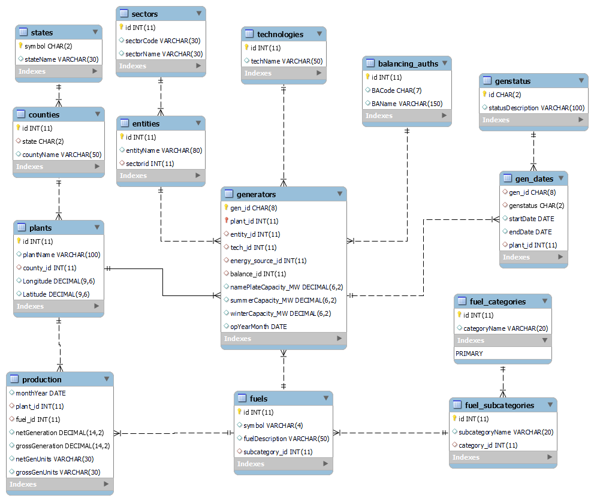

# An Overview of Power Plant Production and Capacity

(All data from the U.S Energy Information Administration.)

## Requirements
MySQL 8.0, Python 3.11, mysql-connector, pandas. Listed with assisting libraries in requirements.txt.

## Create and populate the database
In MySQL, run the create_plant_db.sql file to create the blank schema, and then run the power_plants_procedures.sql file to add the procedures. Once this is done, the Python files can be run in this order:
1. prelim_entry.py
2. get_electric.py
3. get_production.py
4. fuel_cat_insert.py
5. fix_counties.py
6. latitude_longitude.py (only if you want latitude and longitude data)

## Why would anyone want to do this?
Today, there is a lot of talk about how the U.S. should change its energy policy in terms of which methods and fuels, and where to invest money. When formulating an opinion in this area, it may be useful to look into the minutae: the types of power plants producing the most, the states producing the most (with which fuels), the generation capacity over the years etc. All of these questions can be answered using EIA's data organized in the way presented here with varying degrees of efficiency.

## Overview

This is the EER Diagram of the database created and used for this information. The goal is to organize the data from the EIA in a fashion that makes it as simple as possible to analyze. Much of the production information can be seen in [this Tableau workbook](https://public.tableau.com/app/profile/aiden.brent/viz/USEnergyOverview/AnOverviewofUSEnergyProduction), and there is plenty more work that can be done using this data alone. Some queries written in power_plant_exploration.sql provide interesting information as well.

NOTICE: all dates are specific only to the month and year with the first of the month simply being a placeholder (this was done with the purpose of making queries simpler).

## Further discussion
As mentioned above there are a lot more questions that can be answered with this data; however, there are also some problems to solve within the data representation itself. Currently, there has not been much analysis on the technology types of generators, and there may be some useful insights to come from there. Also, looking at the split-up of balancing authorities, and the entities that own the generators could be interesting as well. 

The most noticeable issue with the schema built here is the organization of the generator status across time. I thought it would be helpful to take the EIA information, which has an entry for each generator each month, and instead transform it to rows each representing ranges of months for each status (with a start and end date). While this design is still usable, it requires some workarounds and the choice may not have been worth the space it saved. When it comes to the actual data, there are a significant number of typos (specifically in the counties), and quite a bit of missing information (most generators do not have balancing authorities assigned and many power plants don't have counties). These problems may be solveable using other data sources to add information and point out inconsistencies.

## Sources
U.S. Energy Information Administration. (2023). EIA API: U.S. Electricity Generation Data. Retrieved from https://api.eia.gov/electricity